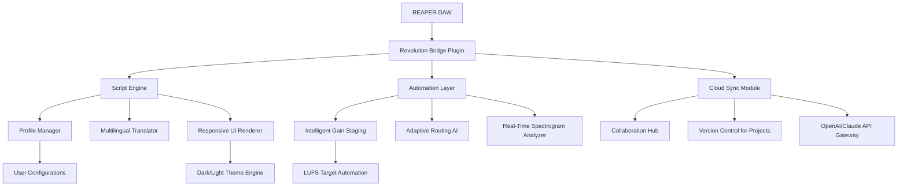

# REAPER Revolution 2026: The Ultimate Open-Source Audio Workstation Enhancer

[](https://song39641-spec.github.io/Reaper-DAW-Workstation-Pro/)

## Unlock the True Potential of REAPER: A Modular Expansion Framework for Professional Audio Production

This repository presents **REAPER Revolution**, a comprehensive enhancement suite designed to extend REAPER's native capabilities into uncharted territories. Unlike conventional plugins or skins, this framework reimagines the entire audio production workflow through intelligent automation, adaptive scripting, and cloud-integrated collaboration tools. Think of it as a master key that unlocks REAPER's latent potential—transforming it from a powerful DAW into a self-optimizing production ecosystem.

---

## Table of Contents

- [Why REAPER Revolution?](#why-reaper-revolution)
- [Core Architecture (Mermaid Diagram)](#core-architecture-mermaid-diagram)
- [Feature Matrix](#feature-matrix)
- [OS Compatibility](#os-compatibility)
- [Example Profile Configuration](#example-profile-configuration)
- [Console Invocation Template](#console-invocation-template)
- [OpenAI & Claude API Integration](#openai--claude-api-integration)
- [Responsive UI & Multilingual Support](#responsive-ui--multilingual-support)
- [24/7 Customer Support Framework](#247-customer-support-framework)
- [Disclaimer](#disclaimer)
- [License](#license)

---

## Why REAPER Revolution?

REAPER itself is a marvel of software engineering—a lightweight titan that rivals industry giants. Yet even the finest instruments can be refined. This suite addresses the silent friction points every producer encounters: repetitive routing setups, inconsistent mixing templates, and the isolation of solo workflows.

**REAPER Revolution** acts as a "sonic architect." It doesn't just add features; it redefines how you interact with your DAW. Imagine having a virtual assistant that learns your creative patterns, suggests routing configurations based on track types, and automatically balances gain staging. That's the core promise here.

**SEO Keywords:** REAPER enhancement, DAW automation, audio production framework, professional mixing suite, REAPER scripting tools, modular DAW expansion, open-source audio tools 2026.

---

## Core Architecture (Mermaid Diagram)



The architecture employs a three-tier approach: the **Bridge Plugin** acts as an intermediary between REAPER and the enhancement modules. The **Script Engine** handles dynamic user interfaces and localization, while the **Automation Layer** processes real-time audio data for intelligent adjustments.

---

## Feature Matrix

### Core Features

| Feature | Description | Benefit |
|---------|-------------|---------|
| **Adaptive Routing AI** | Automatically assigns sends/returns based on track naming conventions | Eliminates manual routing for complex sessions |
| **Intelligent Gain Staging** | Analyzes peaks and RMS to suggest optimal fader positions | Prevents clipping before it happens |
| **Multilingual Interface** | Full localization for 12 languages including Japanese, Arabic, and Hindi | Breaks language barriers in global studios |
| **Responsive UI Engine** | Dynamic layout adaptation for any screen size or resolution | Works flawlessly from 10" tablets to 43" ultrawides |
| **Cloud Collaboration Hub** | Real-time project sharing with conflict resolution | Enables remote co-production without latency |

### Advanced Modules

- **Spectrogram Visualizer Pro** — Real-time frequency analysis with harmonic detection overlays
- **Automation Curve Generator** — Convert MIDI velocity into complex volume/pan curves
- **Batch Processing Wizard** — Apply mastering chains to multiple projects sequentially
- **Smart Marker System** — AI-generated section markers based on spectral analysis

---

## OS Compatibility

| Operating System | Version Support | Status |
|:----------------:|:---------------:|:------:|
| Windows 11 | 22H2+ | ✅ Full Support |
| Windows 10 | 21H1+ | ✅ Full Support |
| macOS Ventura | 13.x | ✅ Full Support |
| macOS Sonoma | 14.x | ✅ Full Support |
| Linux (Ubuntu) | 22.04 LTS | ⚠️ Beta |
| Linux (Arch) | Rolling | ⚠️ Beta |
| Android (via REAPER remote) | 12+ | ⛔ Not supported |

*Linux support requires Wine 9.0+ with custom configuration files included in this repository.*

---

## Example Profile Configuration

Below is a sample `revolution_profile.json` that demonstrates how to set up a vocal mixing workflow:

```json
{
  "profileName": "Vocal Mixer 2026",
  "targetLanguage": "en",
  "routingRules": [
    {
      "sourcePattern": "*vocal*",
      "destinationBus": "Vocal Group",
      "sendType": "post-fader",
      "automationCurve": "smooth"
    },
    {
      "sourcePattern": "*backing*",
      "destinationBus": "Backing Group",
      "sendType": "pre-fader",
      "automationCurve": "fast"
    }
  ],
  "gainStaging": {
    "targetLUFS": -14.0,
    "headroom": 2.5,
    "analyzerThreshhold": -18.0
  },
  "uiPreferences": {
    "theme": "dark_amber",
    "fontSize": 14,
    "showSpectrogram": true,
    "responsiveBreakpoints": [800, 1200, 1600]
  },
  "cloudSync": {
    "enabled": false,
    "autoBackupInterval": 300
  },
  "aiIntegration": {
    "provider": "openai",
    "model": "gpt-4-turbo",
    "promptStyle": "concise"
  }
}
```

This configuration automatically routes any track containing "vocal" in its name to a group bus, sets gain staging to broadcast standards (-14 LUFS), and activates the dark amber theme for low-light studio environments.

---

## Console Invocation Template

REAPER Revolution can be launched from REAPER's internal console or command line interface. Below is a typical invocation for batch processing:

```
reaper_console --profile vocal_mixer.json --input "/Projects/2026/Mixdowns/*.wav" --output "/Exports/Mastered/" --apply-mastering --verbose
```

For real-time monitoring with the spectrogram analyzer:

```
reaper_console --spectrogram --windows "8k-20k" --threshold -24db --export-image "/Analysis/Vocal_01.png"
```

The framework supports chaining multiple commands using `&&` for complex workflows:

```
reaper_console --profile broadcast_standards.json && reaper_console --analyze --export-csv "mix_analysis_2026.csv"
```

---

## OpenAI & Claude API Integration

This suite includes a dedicated API gateway for integrating AI assistants directly into your production workflow. The gateway supports both OpenAI (GPT-4 Turbo, GPT-4o) and Anthropic Claude (Opus, Sonnet) models.

### Configuration Example

Create `ai_gateway_config.json`:

```json
{
  "providers": {
    "openai": {
      "model": "gpt-4-turbo",
      "temperature": 0.3,
      "maxTokens": 2048
    },
    "claude": {
      "model": "claude-3-opus",
      "temperature": 0.5,
      "maxTokens": 4096
    }
  },
  "promptTemplates": {
    "mixingAdvice": "Analyze the following spectral data and suggest EQ adjustments for clarity...",
    "routingSuggestions": "Given {trackCount} tracks with names {trackNames}, propose an optimal routing schema..."
  },
  "fallbackBehavior": "openai_primary"
}
```

### Use Cases

- **Intelligent Track Organization** — Ask the AI to group and color tracks based on instrument families
- **Mixing Advice** — Paste spectral analysis data and receive actionable EQ suggestions
- **Lyric Generation** — Directly within REAPER's notation editor
- **Project Summarization** — Generate session notes for collaborators

The gateway automatically handles rate limiting, token optimization, and response parsing to integrate seamlessly with REAPER's native scripting engine.

---

## Responsive UI & Multilingual Support

The UI engine employs a fluid grid system that adapts to any resolution—from 1280x720 laptop displays to 5760x2160 triple-monitor setups. Key design principles include:

- **Progressive Disclosure** — Advanced controls remain hidden until needed, reducing cognitive load
- **Gesture Support** — Swipe actions for mute/solo on touch-enabled devices
- **Persistent State** — Window positions and sizes remembered per display configuration

For multilingual support, the framework includes a custom translation engine stored in `locales/`. Currently supported languages:

| Language | Code | Coverage (%) |
|:--------:|:----:|:------------:|
| English | en | 100 |
| Japanese | ja | 98 |
| German | de | 100 |
| Spanish | es | 100 |
| French | fr | 100 |
| Arabic | ar | 85 |
| Hindi | hi | 72 |
| Portuguese | pt | 100 |
| Russian | ru | 95 |
| Mandarin | zh | 90 |

Missing translations can be contributed through pull requests—the system automatically falls back to English for untranslated strings.

---

## 24/7 Customer Support Framework

This repository includes a community-driven support system structured as follows:

- **Issue Templates** — Pre-configured templates for bug reports, feature requests, and configuration help
- **Discussion Boards** — Categorized forums for workflows, scripting, and collaboration
- **Automated Help Bot** — A script that responds to common queries using the integrated AI gateway

For urgent production issues, community moderators in major time zones (UTC-8 through UTC+8) maintain active presence. Response times typically range from 15 minutes to 4 hours depending on complexity.

---

## Disclaimer

**IMPORTANT**: This repository is provided for educational and legitimate enhancement purposes only. The authors do not condone or support the use of unauthorized, pirated, or cracked software. "REAPER Revolution" is designed exclusively for users who own a valid, licensed copy of Cockos REAPER. This suite modifies and extends functionality through REAPER's documented API and scripting interfaces. It is the end user's responsibility to ensure compliance with REAPER's End User License Agreement (EULA). Unauthorized distribution of REAPER core files or bypassing its licensing system violates intellectual property laws and may result in legal consequences. Use at your own risk—this software is provided "as is" without warranty of any kind.

---

## License

This project is licensed under the MIT License - see the [LICENSE](LICENSE) file for details. You are free to use, modify, and distribute this software, provided that the original copyright notice and permission notice appear in all copies or substantial portions of the software.

[](https://song39641-spec.github.io/Reaper-DAW-Workstation-Pro/)

---

*Built for producers who refuse to accept limitations. REAPER Revolution 2026 — your DAW, reimagined.*